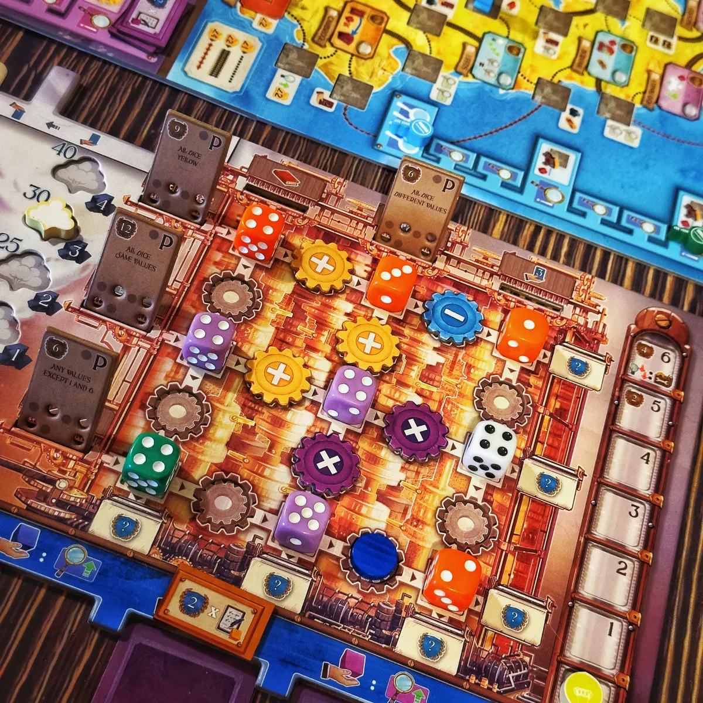
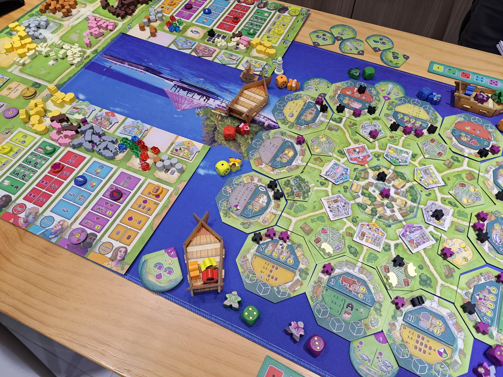
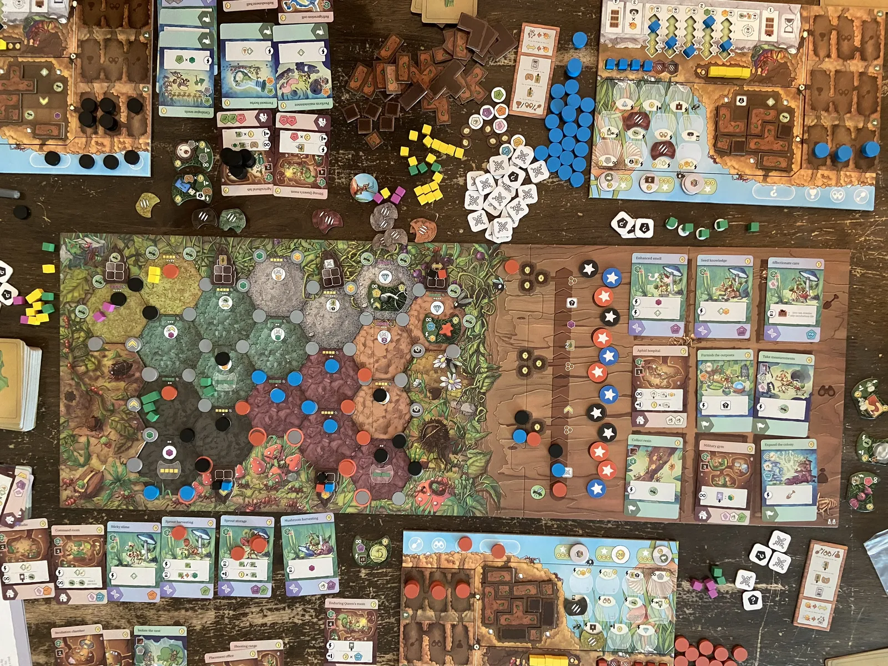
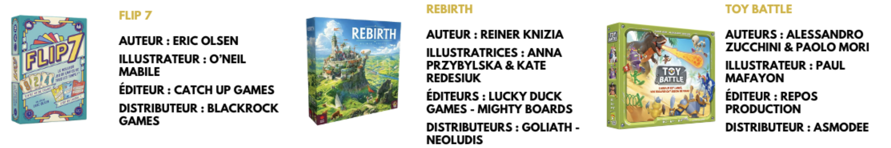
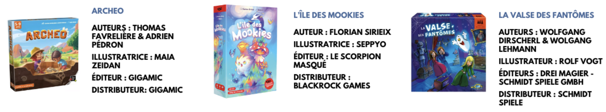
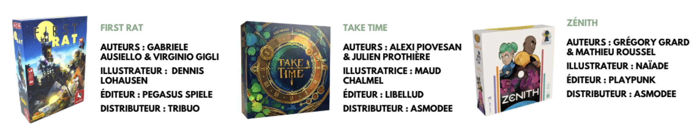
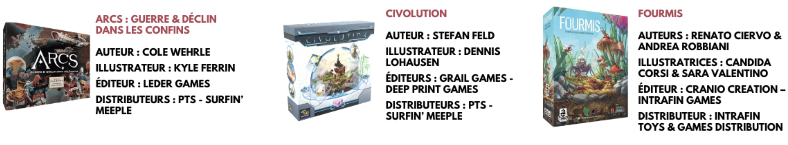

Je propose de faire de petits billets mensuels pour parler un peu des actus autour du JdS, ceci est un premier essai et je l’affinerai au fur et à mesure des publications et de vos retours 🙏🏼

- [Festivals, événements et remises de prix du mois](#festivals-événements-et-remises-de-prix-du-mois)
  - [Podium du Diamant d’or 2026](#comme-partagé-par-looping-plus-tôt-merci-à-toi️-voici-le-podium-du-diamant-dor-2026)
  - [L’As d’Or à la fin du mois, voici les nominés !](#las-dor-à-la-fin-du-mois-voici-les-nominés-)
    - [Nominés "Tout Public"](#nominés-tout-public)
    - [Nominés "Jeu enfant"](#nominés-jeu-enfant)
    - [Nominés "Jeu initié"](#nominés-jeu-initié)
    - [Nominés "Jeu expert"](#nominés-jeu-expert)
- [Sorties attendues](#sorties-attendues)
- [Le petit mot de la fin 🫡](#le-petit-mot-de-la-fin-)

---

# Festivals, événements et remises de prix du mois

- 15/02 Fêtes des Jeux de sociétés - Thaon Les Vosges
- 27/02 au 1/03 Festival International des Jeux (FIJ) - Cannes où il y aura notamment l’élection de l’As d’Or 2026

## Comme partagé par Looping plus tôt (Merci à toi❤️), voici le Podium du Diamant d’or 2026

Pour rappel, le **Diamant d’or** est un prix donné à un jeu par un Jury qui se rassemble fin Janvier à Lille.

>Le but de cette élection est de trouver des jeux experts qui vont durer dans le temps, ainsi pour participer un jeu doit être sorti dans l'année, ne pas être une réédition, être un jeu de type eurogame, être un jeu expert et disposer d'une grande rejouabilité.

Sans plus attendre, voici le podium !

### 1. *“Ada’s Dream”* édité par Alley Cat Games et créé par Toni López, illustré par Javier González Cava

Dans *Ada’s Dream*, vous allez collaborer avec Ada Lovelace pour aider à construire le premier ordinateur. 

Vous aurez 18 tours au cours desquels vous récupérez des dés, des engrenages, et des programmes, donnez des conférences, voyagez en Angleterre et complétez des objectifs donnés par Ada pour l’aider gagner des points de prestige, et pour construire le premier moteur analytique avant les autres.

*→ Jeu de stratégie pour 1-4 joueurs de 14 ans et +, parties de 90-120min*

*Photographie du plateau joueur dans Ada's Dream*

### 2. *“Keyside”* édité par Huch! et créé par Richard Breese, Dávid Turczi, illustré par Vicki Dalton

*Keyside* se déroule sur une île animée comptant 12 ports et une multitude de quais.

Chaque joueur contrôle une équipe de 18 ouvriers, qui œuvrent dans les fermes, les ports, les marchés, la carrière, les champs de blé et les bois.

Les joueurs utilisent leurs 6 dés pour diriger les bateaux vers les ports de leur choix ou pour rejoindre les autres joueurs à leur tour et, dans les deux cas, mettre leur équipe d’ouvriers au travail.

Une fois les dés lancés (phase 1), les ports sont activés (phase 2) et les joueurs obtiennent des actions et des ressources là où se trouvent leurs ouvriers. Après trois manches (années), les joueurs marquent des points en fonction de l'emplacement de leurs ouvriers, notamment dans les ports, mais aussi grâce aux chaumières, maisons et promontoires qu'ils ont construits et aux compétences qu'ils ont acquises. Le joueur qui totalise le plus de points remporte la partie.

*→ Jeu de placement d’ouvrier, pour 1-4 joueurs de 14 ans et +, parties de 90-120min*

*Photographie du plateau de jeu Keyside*

### 3. *“Fourmis”* édité par Intrafin Games, créé par Renato Ciervo et Andrea Robbiani, illustré par Candida Corsi et Sara Valentino

*Fourmis* est un jeu de stratégie complexe axé sur la gestion des ouvrières et l'expansion territoriale. Chaque joueur débute avec une tuile Reine unique parmi plusieurs disponibles, qui influencera fortement sa stratégie et son interaction avec les systèmes interconnectés du jeu. Tout au long de la partie, vous guiderez votre colonie de fourmis à travers des cycles de croissance, d'exploration et de conquête afin d'établir votre domination sur l'écosystème du jardin.

À votre tour, vous effectuez l'une des six actions principales (Creuser, Explorer, Récolter, Incuber, Jouer des cartes ou Combattre des ennemis), et vous pouvez effectuer des actions gratuites pour optimiser l'efficacité de votre colonie. Vous agrandirez votre territoire à l’aide de tuiles hexagonales.

Ainsi, plusieurs manières de gagner se présentent à vous : via la maîtrise architecturale, le contrôle territorial, la croissance démographique, ou encore un jeu de cartes tactique et la conquête de l’ennemi.

*→ Jeu de stratégie, pour 2-4 joueurs de 13 ans et +, parties de 90min*

*Matériel de Fourmis*

### Les autres jeux

Et parmi les nominés restant pour le Diamant d’or, nous avions aussi : *Galactic Cruise*, *Luthier*, *Philarmonix*, *Recall*, et *Sweet Lands*.

## L’As d’Or à la fin du mois, voici les nominés !

Pour rappel, l’As d’Or est un prix attribué lors du FIJ (Festival International des Jeux de Cannes) à un jeu pour lequel les membres du jury ont été séduits par une mécanique innovante, une démarche d'auteur, d'éditeur, la beauté du matériel, la profondeur du propos, l'intelligence du produit et tout simplement leur propre plaisir.

Le prix est distribué à travers plusieurs catégories :
- La catégorie *"Tout public"* concerne les jeux pouvant s'adresser au plus vaste public. Pour y figurer, les jeux doivent pouvoir être joués aussi bien par des adultes et des enfants (à partir de 8 ans), et ce, sur un pied d'égalité. Les jeux doivent avoir des règles faciles à expliquer pour un temps de jeu généralement inférieur à une heure.
- La catégorie *"Jeu Enfant"* récompense les jeux destinés aux enfants de 3 à 7 ans. Sont concernés, les jeux adaptés aux capacités et au besoin des enfants proposant des parties courtes et des règles simples.
- La catégorie *"Jeu Initié"* s’adresse aux joueurs habitués à jouer, se tournant vers des jeux avec des mécanismes plus recherchés. Les parties peuvent dépasser l'heure de jeu, les règles réclament plus d’attention et la mise en place du jeu est plus poussée.
- La catégorie *"Jeu Expert"* récompense les jeux avec des assemblages plus complexes de divers mécanismes de jeu, nécessitant un investissement plus conséquent en compréhension des règles ou en temps de jeu.

### Nominés "Tout Public"

Flip 7, Rebirth et Toy Battle

### Nominés "Jeu enfant"

Archeo, L’île des Mookies et La valse des fantômes

### Nominés "Jeu initié"

First Rat, Take Time et Zénith

### Nominés "Jeu expert"

ARCS : Guerre & Déclin dans les confins (extension avec campagne pour ARCS), Civolution et Fourmis

_**Rendez vous le 26 Février pour connaître les heureux gagnants de ce prix prestigieux!**_

# Sorties attendues

Petite sélection parmi les sortie de février

| **Jeu** | **Genre** | **Prix (fourchette)** | **Editeur / auteur** |
| --- | --- | --- | --- |
| Extension Agent Avenue - Division M | extension jeu à 2 | ~15€ | Par Iello Christian Kudahl / Laura Kudahl |
| Extension Dominion 2e - Soleil Levant | extension deck building 2 à 4j | ~40€ | Par Rio Grande Games Donal X Vaccarino |
| Maître Makatsu | jeu de carte 2 à 6j | ~15-20€ | Par Gigamic Reiner Knizia |
| Fantômes à Foison | Placement de tuiles 2 à 5j | ~25€ | Par Lookout Michael Luu |
| Extension Heat - Rocky Road | Course, cartes 1 à 7j | ~25-30€ | Par Days of wonder Asger Harding Granerud, Daniel Skjold Pedersen |
| Villainous - Larmes de Fond | Combinaison, cartes, pouvoirs 2 à 3J | ~25€ | Par Ravensburger Prospero Hall |
| Château Rossignol | Cartes, Placement, Asymétrie, Gestion 2j | ~20-25€ | Par Sand Castle games Jérémy Fraile, Bruno Cathala, Eliette Fraile |
| Extension Galaxy Trucker - Instructions lunaires | Action, ambiances, Dés 2 à 4j | ~30€ | Par Iello Vlaada Chvátil / David Jablonovsky |
| Transperceneige | Programmation, Bluff, Gestion, Asymétrie, Coopératif 3 à 5j | ~50€ | Par Rose Noire Edition Maxime Artru |

# Le petit mot de la fin 🫡

Si ce genre de publication plaît, d’autres viendront pour les actus (pourquoi pas un billet mensuel ?) et des petits hors série.

Cet espace petit mot de la fin pourra être l’occasion pour vous de partager un coup de cœur, des idées, etc. Anonyme (envoyez-moi un message privé) ou non.

Si vous voulez parler d’un jeu, faire évoluer ce poste, n’hésitez pas à partager vos retours ❤️

__*Avec amitié et bisous, Brojira*__

