<meta property="og:image" content={frontmatter.imageUrl}/>
<meta property="og:title" content={frontmatter.title} />
<meta property="twitter:image" content={frontmatter.imageUrl}/>
<meta property="twitter:title" content={frontmatter.title} />

J'aimerais débuter ce mois d'octobre en vous annonçant qu'autour de notre table ronde un nouveau joueur nous a rejoint : notre petit Arthur !

Pour ce mois d'octobre, comme d'habitude : une revue des festivals du mois, une liste de jeux attendus et une petite présentation. Cette présentation plaira aux amateurs de jeux à 2 car on regardera quels JdS peuvent faire une bonne alternative aux échecs.

**Bonne lecture ❤️**

* [Festivals et événements](#festivals-et-événements)
* [Sorties attendues](#sorties-attendues)
* [Une p'tite prez: des alternatives aux échecs ?](#une-ptite-prez-des-alternatives-aux-échecs-)
* [Quel archétype es-tu ? ⚡](#quel-archétype-es-tu--)

# Festivals et événements

| | |
| --- | --- |
| 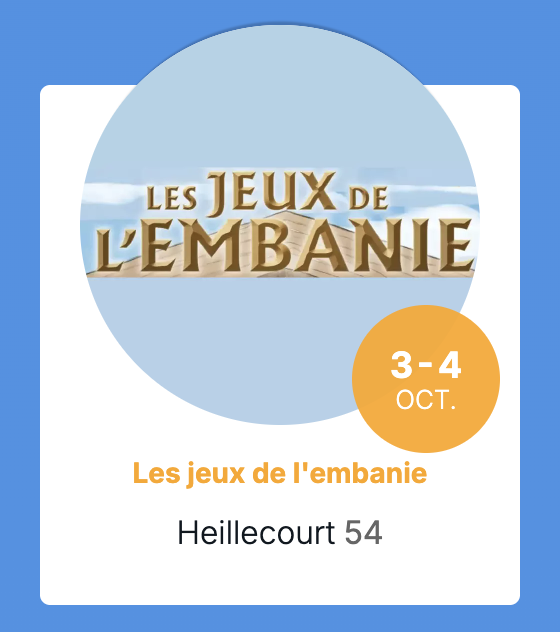 | 2 jours de jeux, tournois tout le week-end, animations extérieures, panier garni de jeux à peser et gagner, buvette et restauration sur place.  📅 du 3 au 4 octobre 2026  - Samedi de 14h à 23h - Dimanche de 10h à 18h 🎟️ Entrée gratuite, 600 personnes estimées 📍 MTL de Heillecourt 54180 Heillecourt, Meurthe-et-Moselle|
| 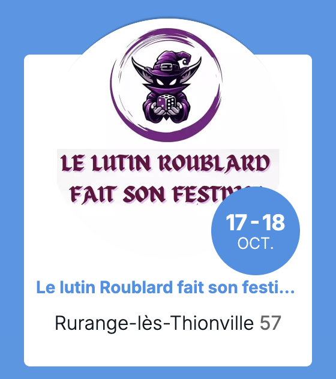 | Deux jours de festivités autour du jeu de société. Venez profiter de centaines de jeux animés, de tournois, d’escape games, d’enquete, de challenge et repartez avec vos coups de cœurs grâce à la boutique sur place de la caverne du gobelin.  📅 du 17 au 18 octobre 2026  - Samedi de 13h30 à 22h - Dimanche de 13h30 à 19h 🎟️ Entrée gratuite 📍 Rue des écoles 57310 Rurange-lès-Thionville, Moselle |
| 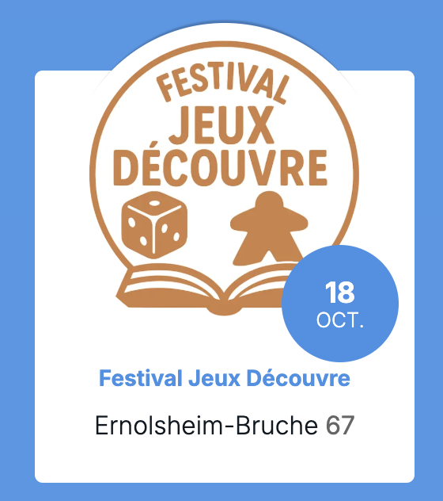 | Le Festival Jeux Découvre c'est une journée autour du jeu de société le dimanche 18 octobre 2026 de 10h à 18h à la salle omnisports d'Ernolsheim-Bruche 🎲 Entrée libre et gratuite 😎 La boutique FunGames sera également présente et vous proposera un beau stand riche en nouveautés ludiques 🤩 Oserez-vous pousser la porte pour découvrir de nouveaux jeux de société qui n'existent pas encore en magasin mais aussi de pouvoir échanger avec leurs auteurs ? 🤫😍 Pour l'occasion vous pouvez également venir déguisé 🎃👻 Vous pourrez également participer sur toute la journée à plusieurs parties de Loup-garou de Thiercelieux 🐺🔍 Une zone enfants avec des jeux de société pour les plus petits sera aussi en libre accès 👦👧 Tombola gratuite avec de beaux lots à gagner 🎁 Buvette sur place et restauration 🍽️  📅 dimanche 18 octobre 2026 de 10 à 18h 🎟️ Entrée gratuite 📍 7 Allée du Stade, 67120 Ernolsheim-Bruche, Bas-Rhin |

# Sorties attendues

Quelques sorties de jeux attendus, mais bien entendu beaucoup d’autres jeux sortent ce mois ci 😁

## Extensions et suite de jeu

| | |
| --- | --- |
| 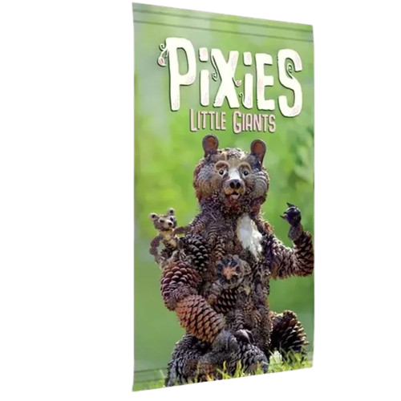 | **Pixies Little Giants**  👨‍👩‍👦 2-6 joueurs 🎂 8+ ⏱ 30 min 💡 Johannes Goupy 🎨 Sylvain Trabut 🛠️ Bombyx 🚚 Asmodee 5€ |
| 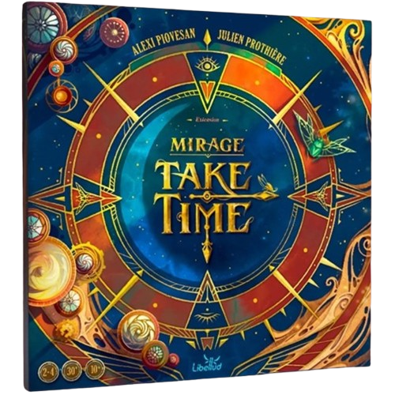 | **Take Time Mirage**  👨‍👩‍👦 2-4 joueurs 🎂 10+ ⏱ 30 min 💡 Julien Prothière, Alexi Piovesan 🎨 Maud Chalmel 🛠️ Libellud 🚚 Asmodee 8€ |
| 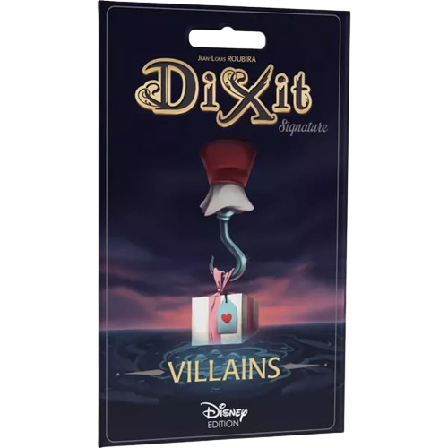 | **Dixit Signature Vilain**  👨‍👩‍👦 3-12 joueurs 🎂 8+ ⏱ 30 min 💡 Jean-Louis Roubira 🎨 James Rey Sanchez 🛠️ Libellud 🚚 Asmodee 9€ |
| 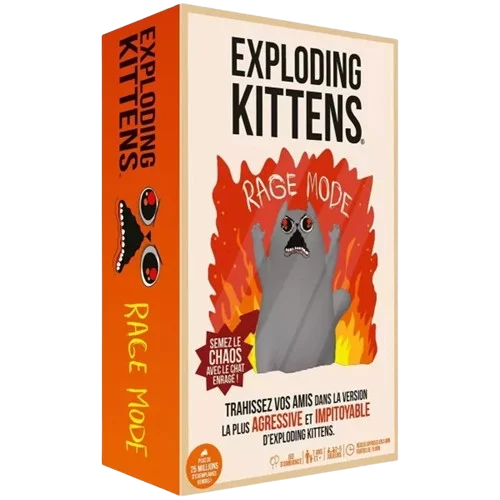 | **Exploding Kittens : Rage Mode**  👨‍👩‍👦 2-5 joueurs 🎂 7+ ⏱ 15 min 🛠️ Exploding Kittens 🚚 Asmodee 18€ |

## Jeux

| | |
| --- | --- |
| 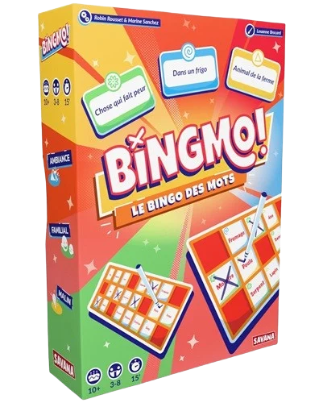 | **Bingmo**  👨‍👩‍👦 3-8 joueurs 🎂 10+ ⏱ 20 min ⚙️ Mots, Collection 💡 Robin Rousset, Marine Sanchez 🎨 Louanne Brocard 🛠️ Savana 🚚 Blackrock Games 27€ |
| 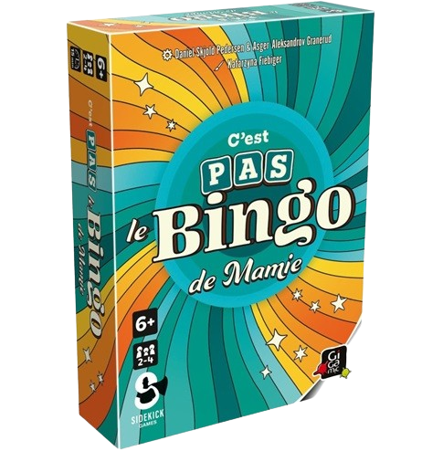 | **C’est pas le Bingo de Mamie**  👨‍👩‍👦 2-4 joueurs 🎂 6+ ⏱ 15 min ⚙️ Collection 💡 Asger Aleksandrov Granerud Daniel Skjold Pedersen 🛠️ Gigamic 19€ |
| 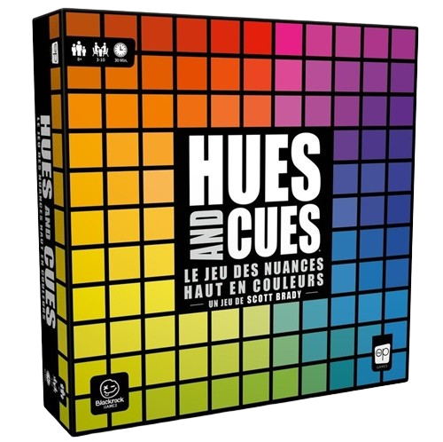 | **Hues and Cues**  👨‍👩‍👦 3-10 joueurs 🎂 8+ ⏱ 30 min ⚙️ Déduction, Association d’idées, Com limitée 💡 Scott Brady 🛠️ The OP games 🚚 Blackrock Games Exploration 24-29€ |
| 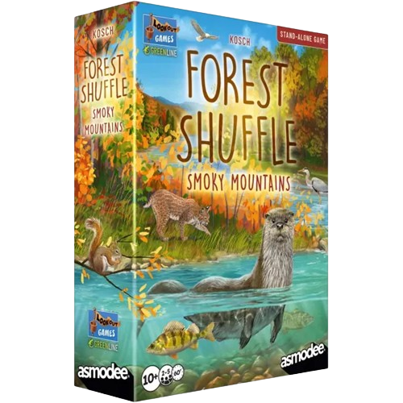 | **Forêt Mixte Smoky Mountains**  👨‍👩‍👦 2-5 joueurs 🎂 10+ ⏱ 60 min ⚙️ Tableau-building, Draft 💡 Kosch 🎨 Toni Llobet, Judit Piella 🛠️ Lookout Games 🚚 Asmodee 26€ |
| 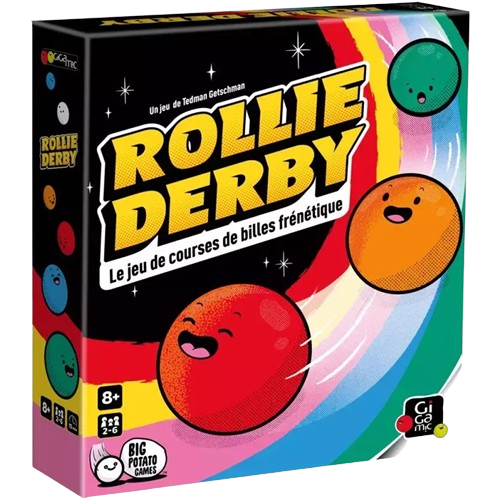 | **Rollie Derby**  👨‍👩‍👦 2-6 joueurs 🎂 8+ ⏱ 25 min ⚙️ Ambiance, Collection, Course 💡 Tedman Getschman 🎨 Beks Barnett 🛠️ Gigamic 22€ |
| 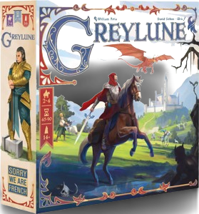 | **Greylune**  👨‍👩‍👦 2-4 joueurs 🎂 14+ ⏱ 60 min ⚙️ Gestion de ressources, Engine-Building, Pose d’ouvriers 💡 William Attia 🎨 David Sitbon, Ulrich 🛠️ Sorry We Are French 🚚 Gigamic 26€ |
| 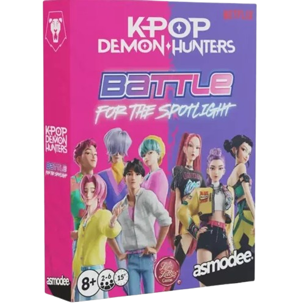 | **Love Letter - K-pop Demon Hunters**  👨‍👩‍👦 2-6 joueurs 🎂 8+ ⏱ 15 min ⚙️ En équipe, Déduction, Gestion de main 💡 Seiji Kanai, Waleed Ma’arouf 🛠️ Zman Games 🚚 Asmodee 14€ |

# Une p'tite prez: des alternatives aux échecs ?

Les échecs, c'est **LA** référence du jeu de stratégie en duel : deux camps, zéro hasard, toutes les cartes sur table (ou presque, puisqu'on ne lit pas dans les pensées de l'adversaire !). Mais il faut l'avouer, apprendre les échecs prend du temps, le matériel traîne rarement dans toutes les ludothèques, et sa réputation un peu intimidante peut freiner certains joueurs et joueuses.

Bonne nouvelle : le monde du jeu de société regorge d'alternatives qui reprennent cet ADN du duel abstrait à information parfaite (tout le monde voit tout, tout le temps), mais avec des parties plus courtes, des thèmes variés, et des mécaniques qui viennent twister les codes du genre. Voici 6 jeux à tester si vous aimez l'esprit des échecs, sans forcément vouloir (re)apprendre à faire un roque 😉

---
## **Onitama**
_~20-30€_

Onitama est sans doute le jeu le plus fidèle à l'esprit des échecs sur cette liste. Chaque joueur dispose d'un Maître (l'équivalent du roi) et de quatre élèves, sur un plateau en grille de 5x5. Pour gagner, il faut soit capturer le Maître adverse, soit faire entrer le sien sur la case de départ de l'adversaire.

La grande différence avec les échecs ? Les déplacements possibles ne dépendent pas de la pièce que l'on joue, mais de cartes "animal" communes aux deux joueurs, piochées en début de partie et qui changent à chaque coup joué. Un vrai jeu de lecture et d'anticipation, pour des parties qui tiennent en 15 minutes.

---
## **Leaders**
_~25€_

Même objectif que les échecs : capturer le Leader adverse. Mais avant même de commencer à jouer, chaque joueur recrute son équipe parmi 19 personnages aux capacités uniques, ce qui change déjà la donne par rapport aux pièces figées d'un jeu d'échecs classique.

Résultat : une mécanique de capture et de déplacement familière, mais une grosse variabilité d'une partie à l'autre selon les personnages recrutés, qui permet de renouveler sans cesse les stratégies possibles.

---
## **Santorini**
_~30€_

Santorini garde le plateau en grille et le tour par tour des échecs, mais y ajoute une dimension totalement absente de ces derniers : la hauteur. Chaque joueur contrôle deux bâtisseurs qui doivent construire des tours tout en empêchant l'adversaire de grimper au sommet le premier.

Le jeu se joue en mode "pur" (sans pouvoir spécial, pour les puristes qui veulent une expérience proche des échecs), ou en mode avancé avec des cartes "divinités" qui apportent des pouvoirs uniques et renouvellent les parties.

---
## **Hive**
_~20-30€_

Avec Hive, on change de paradigme : il n'y a plus de plateau fixe ! Les pièces, en forme d'hexagones représentant des insectes, s'accolent les unes aux autres au fil de la partie et forment elles-mêmes la structure de jeu, qui grandit et se transforme à chaque coup.

L'objectif reste pourtant très échiquéen : encercler complètement la Reine adverse. Une bonne option aussi pour les amateurs de jeux nomades, puisque tout le matériel tient dans une petite pochette de voyage.

---
## **Gygès**
_~45€_

Sorti en 1985 et récompensé au Concours International de Créateurs de Jeux de Société, **Gygès** propose un twist radical par rapport aux échecs : personne ne possède les pièces. À son tour, chaque joueur ne peut déplacer qu'une pièce de la ligne la plus proche de lui, peu importe qui l'a posée à l'origine.

L'objectif est d'amener une pièce jusqu'à la dernière ligne adverse, en jouant sur les déplacements, rebonds et remplacements que permettent les différentes hauteurs d'anneaux. Un jeu aux règles simples, mais qui demande une vraie gymnastique mentale pour anticiper les coups de l'adversaire... avec ses propres pièces.

---
## **Demain tu m'as tué**
_~45€_

On termine avec le jeu le plus éloigné des échecs dans cette sélection, même s'il en garde l'essentiel : un duel abstrait à information parfaite. Les deux joueurs incarnent des voyageurs temporels rivaux qui tentent de s'effacer mutuellement de l'histoire, sur trois plateaux représentant le passé, le présent et le futur.

Sa grande singularité : une structure narrative en plusieurs chapitres, qui introduit progressivement de nouvelles règles et de nouveaux éléments de jeu au fil des parties. De quoi complètement dépayser les habitués des échecs, tout en gardant ce plaisir de la pure réflexion stratégique en duel.

---

Et voilà pour ce tour d'horizon des duels abstraits ! De la fidélité presque parfaite d'Onitama jusqu'à la voltige temporelle de Demain tu m'as tué, en passant par les tours de Santorini ou les pièces sans propriétaire de Gygès, on voit bien que l'esprit des échecs (stratégie pure, zéro hasard, duel à info parfaite) peut s'incarner dans des formes très différentes.

Alors, prêt à ranger l'échiquier pour tester un de ces jeux ? Et vous, quel est votre jeu abstrait préféré pour gratter ce besoin de réflexion pure à deux ? 🧠♟️

# Quel archétype es-tu ? ⚡

Ce mois ci, j'aimerais remercier **Hugo** pour de chouettes duels qu'on a pu faire au *FestiLooping* ! 😉

Pyrate et Damien on mener le dernier duel de la journée avec les decks d'initiation, j'espère que ça vous a plu 😊 Le Yu-Gi-Oh moderne **démarre vite et fort** (comme l'archétype dont on va parler aujourd'hui 🏎️) je préparerai donc des decks rétro, plus sain pour démarrer le jeu car moins de texte sur les cartes 😉

De retour à toi Hugo, j'ai pensé à cet archétype pour toi : **F.A.** (*Formula Athletes*). Il propose des Synchros et des voitures de courses, _**FAST and FURIOUS !**_ 

D'abord sorti chez nous en 2017 puis arrivé en OCG plus tard la même année, cet archétype a des monstres qui semblent d'abord faiblards, voire nuls : **0 ATK**. Par contre ils ont une facultée qui permet de mettre de sacrées raclées : ils gagnent 300 ATK par niveau, et leur niveau augmente (sans limite d'ailleurs) ! Et comme taper fort ne suffit pas, une fois le niveau 7 atteint, la plupart gagnent un effet supplémentaire 🤯

Un petit niveau 13 avec 3900 ATK ? Pas mal hein ? Et s'il est niveau 7 ou plus il peut attaquer 2 fois : *absolute destruction* ! Il leur faut juste un peu de temps pour prendre de la vitesse, et le deck a des astuces pour ça !

_**Cité Grand Prix F.A.**_ : Une magie de terrain qui leur donne 2 niveaux supplémentaires en Main Phase et Battle Phase, tout en empêchant votre adversaire de cibler vos monstres F.A. avec des effets de cartes ... Ça semble être un bon coup de pouce en effet 🤭

|||
|---|---|
|  |  |
|  |  |

L'archétype possède en plus des _Quick Synchro_ à savoir des invocations synchro pendant le tour adverse, de quoi multiplier les interruptions ! De plus, les monstres sont de type Machine et attribut Vent, ce qui permet d'aller piocher du support dans d'autres archétypes, comme **Vitesseroid** et du support comme "*Mécano Mécanique*" sorti en Février cette année avec "*Dragon Méca Jade*" qui rendent le deck plus polyvalent.

Petit bonus, pas vraiment jouée compétitivement, les **F.A.** ont une carte avec une condition de victoire alternative : _**Vainqueurs F.A.**_ ; à chaque fois qu'un monstre F.A. détruit un monstre adverse au combat alors qu'il a 5 niveaux de plus que d'origine, alors on peut bannir un de notre propre carte de n'importe où (on choisit un des nombreux terrains). Si on a bannit par cet effet 3 terrains différents, alors on gagne le duel ! *Certains decks FTK ont utilisé cette carte pour gagner au premier tour !*

L'archétype F.A. a toujours été considéré moyen (avantage : il coûte presque rien à construire), mais dans le nouveau format Genesys, les joueurs lui laisse une chance de briller ! J'ai hâte de voir ce que ça peut donner aujourd'hui 😀

---

J’espère que ce billet d'octobre vous aura plu, si vous avez un jeu, un thème ou autre chose que vous aimeriez voir aborder la prochaine fois, n’hésitez pas à me le faire savoir 🙌

Et surtout, proposez-moi la prochaine personne qui se verra associée à des cartes Yu-Gi-Oh! pour le prochain “Quel archétype es-tu ?” 😀

Avec amitié et bisous, **Brojira**
 
